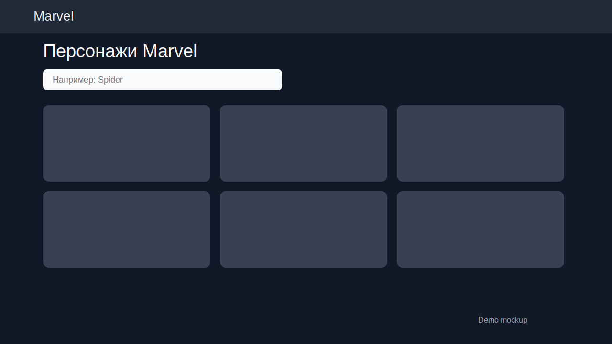
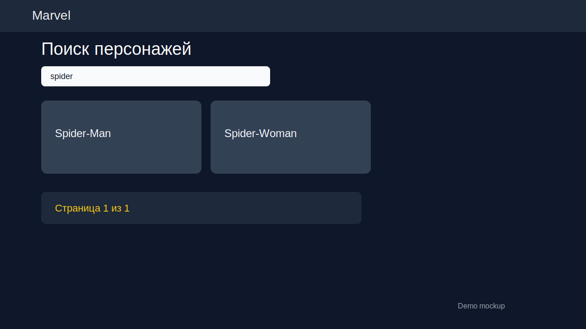
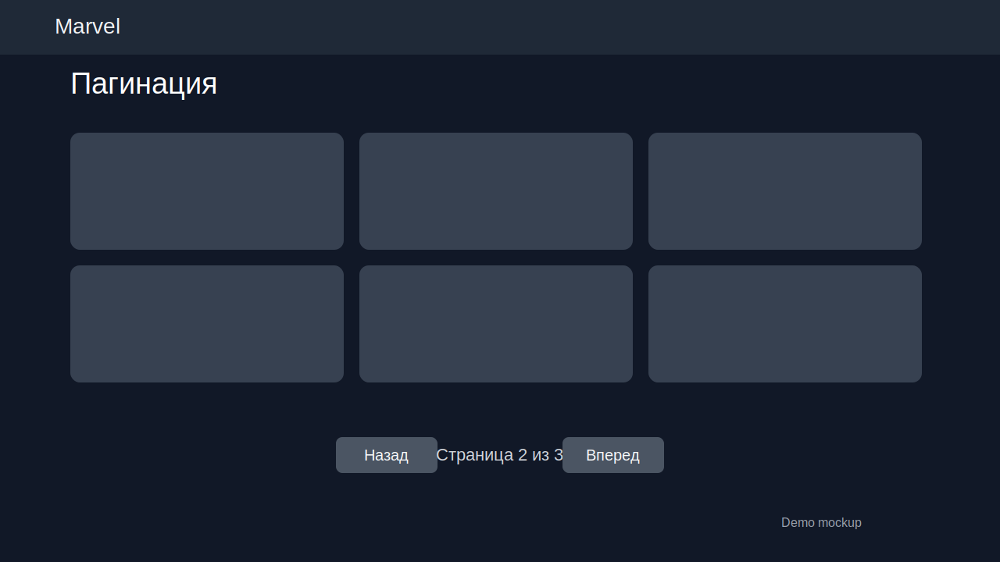

# js-marvel

Vanilla JavaScript mini-app that loads Marvel characters from a public API and renders cards + modals.

## Problem
Need a simple frontend project that demonstrates:
- external API integration
- async loading and error handling
- dynamic DOM rendering without frameworks

## Stack
- HTML5
- CSS (Bootstrap 5)
- JavaScript (ES6+)
- Public Superhero API: `https://akabab.github.io/superhero-api/`

## Setup
No build step required.

```bash
git clone https://github.com/xelvhk/js-marvel.git
cd js-marvel
cp .env.example .env
# open index.html in browser
```

Or run any local static server, for example:
```bash
python -m http.server 8000
# then open http://localhost:8000
```

Run tests:
```bash
node --test tests/*.test.js
```

## Architecture
- `index.html`: layout, containers, bootstrap imports
- `index.js`: API call + card/modal template functions
- `start.js`: app bootstrap, search flow, pagination state
- `utils.js`: mapping/filter/pagination utilities (reusable + testable)

## Demo / Screenshots
- Live demo: [https://xelvhk.github.io/js-marvel/](https://xelvhk.github.io/js-marvel/)
- Demo mockups:





## Roadmap
- [x] Add search/filter by hero name
- [x] Add client-side pagination
- [x] Add unit tests for mapper functions
- [x] Improve accessibility (ARIA labels, keyboard modal flow)
